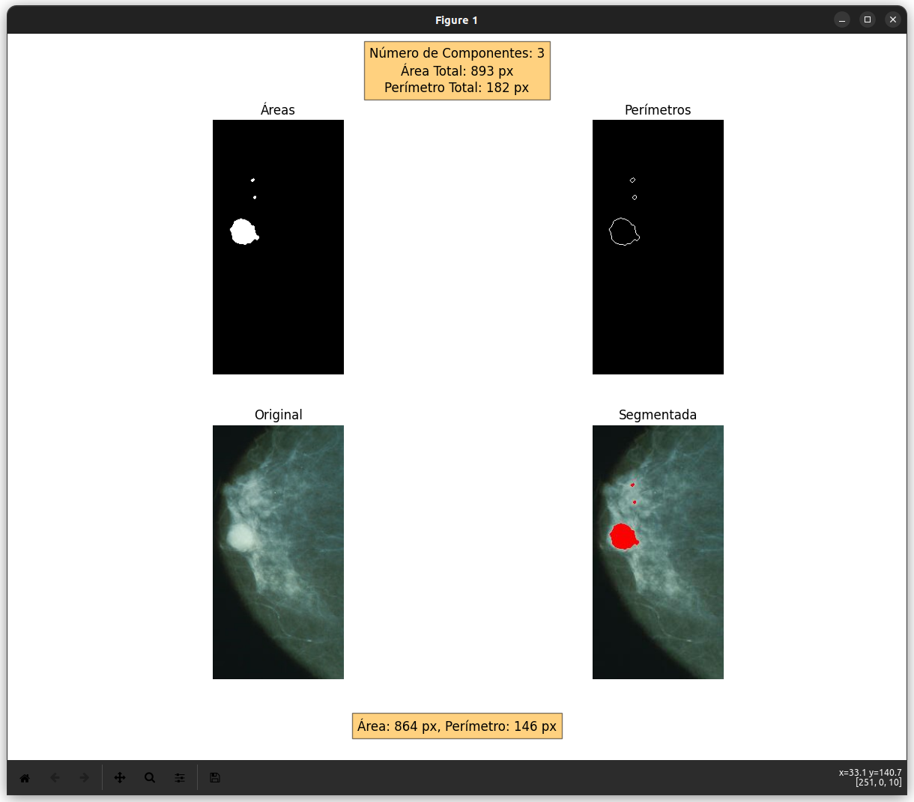

# Segmentacion de calcificaciones en imagenes de mastografias

 Deteccion de calcificaciones en mastografias utilizando diversas tecnicas de procesamiento digital de imagenes.

# Instrucciones para Ejecutar el Script

  

Para ejecutar el script, usa el siguiente comando en tu terminal:
```
python3 deteccion.py nombre.formato
```
  
  

## Ejemplo de Resultado
<p  align="center">
	
</p>


## Licencia

Este proyecto está licenciado bajo la Licencia MIT - ver el archivo [LICENSE](LICENSE) para más detalles.
